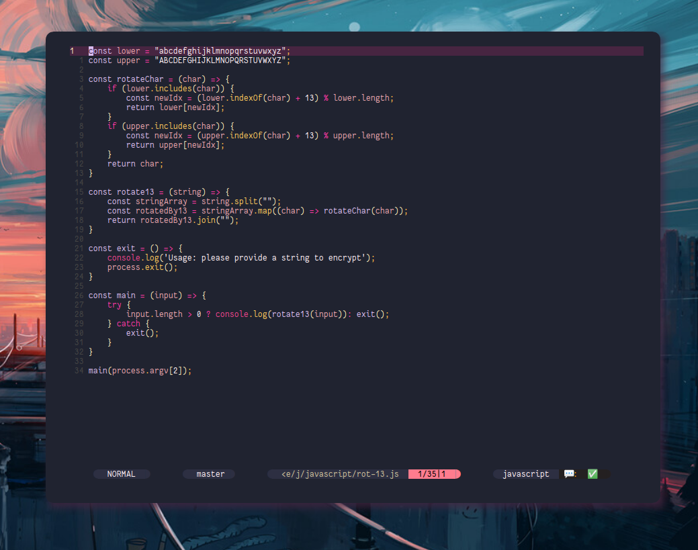

# Pinkmare

PinkMare was born from the need of wanting something like Miramare but with a bit more standing out colors.

The aim of Pinkmare was to add a dash of bright red colors to the theme, while creating a bit more pastel experience

# Example


# Installation

### Vim

```vim
Plug 'matsuuu/pinkmare'
```

### VSCode

[Pinkmare in the VSCode Marketplace](https://marketplace.visualstudio.com/items?itemName=Matsuuu.pinkmare)

# Usage

```vim
set termguicolors
colorscheme pinkmare
```

**PinkMare works best with [nvim-treesitter](https://github.com/nvim-treesitter/nvim-treesitter) now!**

# Inspirations

[Miramare](https://github.com/franbach/miramare)

[PinkCatBoo](https://github.com/ftsamoyed/PinkCatBoo)

# NOTE

Pinkmare has been kind of hacked together from the miramare theme, and isn't currently fully finished.
Some coloring changes might come along the way, as well as updating the colors profiles to match the new settings.

Current tested environments are Javascript and Java (to an extent at least).

Feel free to contribute to the development of Pinkmare

## Colorcodes

Colorcodes used by pinkmare

-  bg0 - Black
-  bg1 - DarkGrey
-  bg2 - DarkGrey
-  bg3 - DarkGrey
-  bg4 - Grey
-  bg_red - DarkRed
-  bg_green - DarkGreen
-  bg_blue - DarkBlue
-  fg - White
-  red - Red
-  orange - Orange
-  yellow - Yellow
-  green - Green
-  cyan - Cyan
-  blue - Blue
-  purple - Purple
-  grey - Grey
-  light_grey - LightGrey
-  gold - Gold
-  none - NONE


```vim
let s:palette = {
      \ 'bg0':        ['#202330',   '235',  'Black'],
      \ 'bg1':        ['#472541',   '236',  'DarkGrey'],
      \ 'bg2':        ['#472541',   '237',  'DarkGrey'],
      \ 'bg3':        ['#472541',   '238',  'DarkGrey'],
      \ 'bg4':        ['#2d2f42',   '239',  'Grey'],
      \ 'bg_red':     ['#f2448b',   '52',   'DarkRed'],
      \ 'bg_green':   ['#333b2f',   '22',   'DarkGreen'],
      \ 'bg_blue':    ['#203a41',   '17',   'DarkBlue'],
      \ 'fg':         ['#FAE8B6',   '223',  'White'],
      \ 'red':        ['#FF38A2',   '167',  'Red'],
      \ 'orange':     ['#ffb347',   '208',  'Red'],
      \ 'yellow':     ['#ffc85b',   '214',  'Yellow'],
      \ 'green':      ['#9cd162',   '108',  'Green'],
      \ 'cyan':       ['#87c095',   '108',  'Cyan'],
      \ 'blue':       ['#eba4ac',   '109',  'Blue'],
      \ 'purple':     ['#d9bcef',   '175',  'Magenta'],
      \ 'grey':       ['#444444',   '245',  'LightGrey'],
      \ 'light_grey': ['#6D7A72',   '245',  'LightGrey'],
      \ 'gold':       ['#fff0f5',   '214',  'Yellow'],
      \ 'none':       ['NONE',      'NONE', 'NONE']
      \ }
```


# Examples

HTML


Javascript



Java


C++


Go


Python


Ruby


